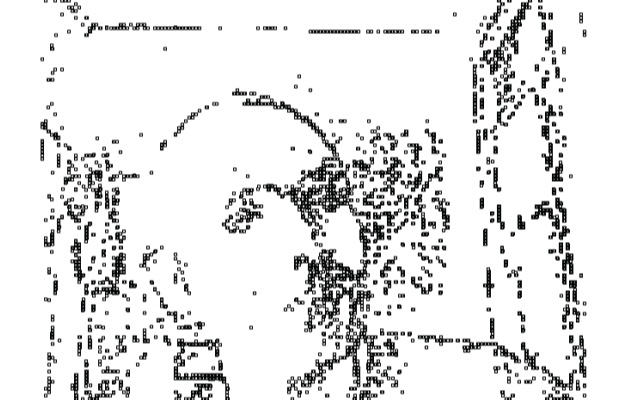

Pixelmotion
===========

Pixel Motion is a project which reacts to gestures of users. It includes a
camera and a c++ software in order to work. Basically, if an user goes in
front of the camera and stands still for a certain amount of time, the particles
transforms into his/her shape. Whenever he/she moves, the particles scrambles. I
was imagining this piece to be installed in busy streets and watch people's
interaction with it. You can download and run it from the below url (works only
on macs). Make sure you have a camera attached in your system.

It was built in 2006 for Pixel by Pixel class using Carbon Framework (deprecated
now)

